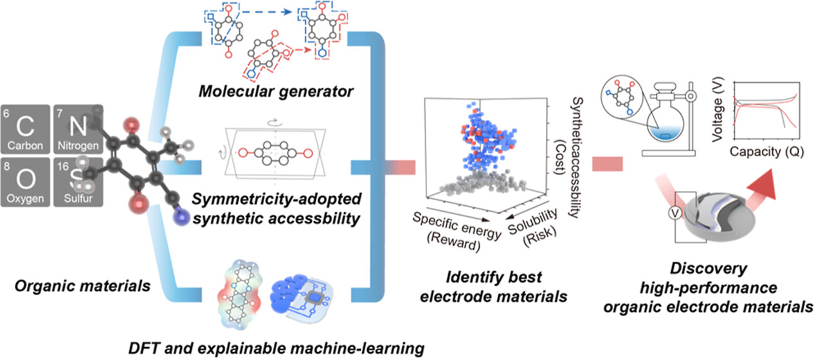

**Abstract**
Organic electrode materials (OEMs), composed of abundant elements such as carbon, nitrogen, and oxygen, offer sustainable alternatives to conventional electrode materials that depend on finite metal resources. The vast structural diversity of organic compounds provides a virtually unlimited design space; however, exploring this space through Edisonian trial-and-error approaches is costly and time-consuming. In this work, we develop a new framework, SPARKLE, that combines computational chemistry, molecular generation, and machine learning to achieve zero-shot predictions of OEMs that simultaneously balance reward (specific energy), risk (solubility), and cost (synthesizability). We demonstrate that SPARKLE significantly outperforms alternative black-box machine learning algorithms on interpolation and extrapolation tasks. By deploying SPARKLE over a design space of more than 670,000 organic compounds, we identified ≈5000 novel OEM candidates. Twenty-seven of them were synthesized and fabricated into coin-cell batteries for experimental testing. Among SPARKLE-discovered OEMs, 62.9% exceeded benchmark performance metrics, representing a 3-fold improvement over OEMs selected by human intuition alone (20.8% based on six years of prior lab experience). The top-performing OEMs among the 27 candidates exhibit specific energy and cycling stability that surpass the state-of-the-art while being synthesizable at a fraction of the cost.

