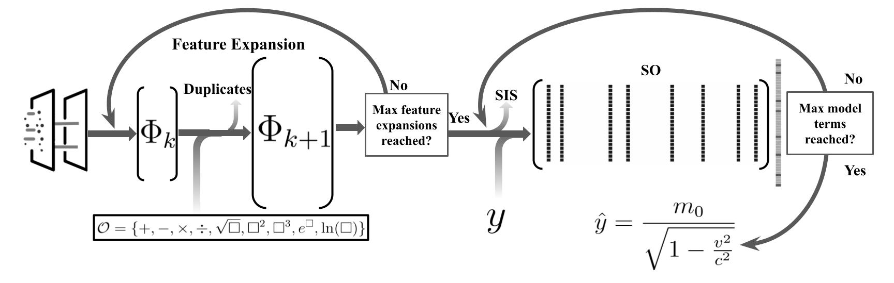

**Abstract**
Symbolic regression (SR) is a powerful machine learning approach that searches for both the structure and
parameters of algebraic models, offering interpretable and compact representations of complex data. Unlike
traditional regression methods, SR explores progressively complex feature spaces, which can uncover simple
models that generalize well, even from small datasets. Among SR algorithms, the Sure Independence Screening
and Sparsifying Operator (SISSO) has proven particularly effective in the natural sciences, helping to rediscover
fundamental physical laws as well as discover new interpretable equations for materials property modeling.
However, its widespread adoption has been limited by performance inefficiencies and the challenges posed by
its FORTRAN-based implementation, especially in modern computing environments. In this work, we introduce
TorchSISSO, a native Python implementation built in the PyTorch framework. TorchSISSO leverages GPU
acceleration, easy integration, and extensibility, offering a significant speed-up and improved accuracy over the
original. We demonstrate that TorchSISSO matches or exceeds the performance of the original SISSO across
a range of tasks, while dramatically reducing computational time and improving accessibility for broader
scientific applications.

